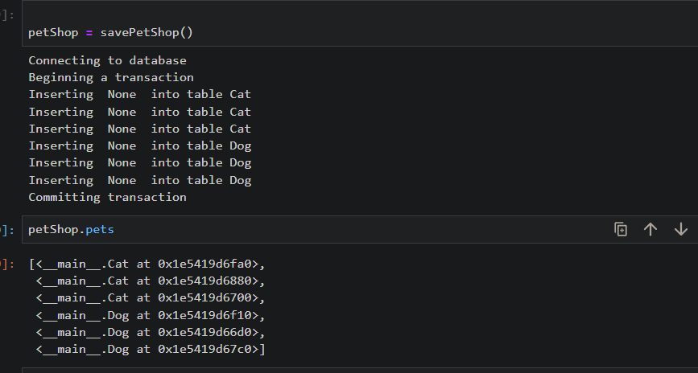
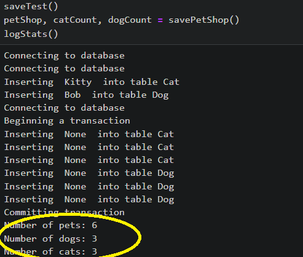

## Python Code

The code provided in the Assignment.ipynb file consists of three parts.


To run the Assignment.ipynb


```bash
$jupyter notebook
```
Then open the Assignment.ipynb at


http://localhost:8888/notebooks/Assignment.ipynb

After that, run all cell by click to 


In Part 1, there are two classes defined - "Cat" and "Data". 
The "Cat" class represents a cat object with attributes such as name, age, and favorite food. 
It also has methods to get and set these attributes. The "Data" class is used to interact with a database. 
It has methods to begin a transaction, commit changes, rollback changes, and insert data into the database.


In Part 2, the "Cat" class is modified to include additional functionality. It now has methods to make the cat speak,
track its name history, and calculate the average length of its name. The code also demonstrates the usage of these methods.
To test the name of cat, set it as the number *Garfield, 0,1,2,3,4.*


Part 3 introduces a new class called "Dog", which is similar to the "Cat" class. 
It has similar attributes and methods but with different default values and a different speak message.



However, in the requirement, there are 3 nameless cats and 3 nameless dogs which make  
function ```object.getName()``` return ```None```. Hence, it cannot be printed as the pseudo code


```angular2html
method insert (table, object) {
        print "Inserting " + object.getName() + " into table " + table
    }
}
```
Hence, it is changed to


```angular2html
def insert(self, table, object):
       print(f"Inserting  {object.getName()}  into table {table}")
       self.pets.append(object)

```
On the other hand, because we want to guarantee that all six pets (or zero pets) are persisted, hence, a list of pets is 
considered to manage these pets. 
```angular2html
self.pets.append(object)
```

As for the file structure, it seems that the code is provided in a Jupyter Notebook format (.ipynb). 
The notebook contains multiple cells, each containing either markdown or code. 
The code cells can be executed individually.
Overall, the code aims to demonstrate the usage of classes and methods to create and manipulate cat and dog objects, 
as well as interact with a database.


According to the code result, the interesting information of *logStats()* is the number of pets which you can easily 
see at


To run the unitest
```bash
python test.py

```
or
```bash
pip install nose
```
then run
```bash
nosetests
```


## SQL
To test the sql
import the file homework.sql to the 
https://sqliteonline.com/

