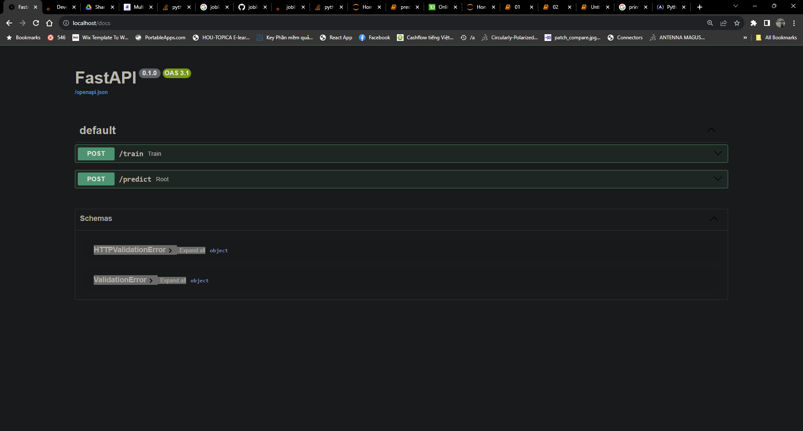

1/ Using docker

open the terminal
```docker-compose up```

open the browser




If you want to train the model from the beginning, click to the train tab and Try it out


If you want to test the forecasting, click to the predict and Try it out


2/using cmd
```angular2html
pip install -r requirements.txt
uvicorn main:app --reload
```
You can test with Postman

